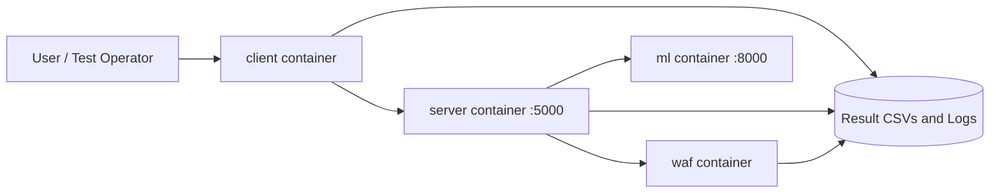

# TEE-WAFs-Framework

Test execution environment for Web Application Firewalls (WAFs), including an ML-based WAF service, a target server, a client/fuzzer, and a WAF container.

## Overview

This repository provides a reproducible Docker-based setup to evaluate WAF behavior and compare outcomes across fuzzing rounds and payload sets.

## Research Context

Web Application Firewalls (WAFs) are a first line of defense for inspecting incoming HTTP requests and filtering malicious payloads. In practice, separating malicious and benign traffic is difficult, and there is no universal detection criterion that works across all scenarios.

Machine Learning (ML) has emerged as an alternative to rule-based WAFs by learning decision boundaries from data instead of relying only on manually crafted signatures. However, ML-WAF reliability remains uncertain because recurring dataset and evaluation biases can inflate performance under controlled conditions while reducing robustness in adversarial settings.

This project supports a benchmarking methodology to systematically measure such biases across three dimensions:

- dataset diversity
- training validity
- evaluation robustness

The framework is applied to WafBrain as an in-depth case study and also validated on Barracuda WAF, a widely deployed commercial product.

Main services in [docker-compose.yml](docker-compose.yml):

- `client`: sends payloads and fuzzed requests
- `server`: target web app
- `ml`: WAF-Brain based ML service
- `waf`: ModSecurity/Apache based WAF container

## Architecture and Request Flow

Service topology from [docker-compose.yml](docker-compose.yml):

- `client` generates and sends payload traffic.
- `server` is exposed on host port `5000`.
- `ml` is exposed on host port `8000`.
- `waf` and `ml` are upstream dependencies for `server`.



Typical execution flow:

1. `client` reads payloads and fuzzing settings.
2. `client` sends requests to `server`.
3. `server` evaluates traffic with `waf` and `ml` support.
4. All components write logs; client writes benchmark CSV results.

## Prerequisites

Install the following before running:

- Docker Desktop (includes Docker Compose)
- Git
- Optional: Python 3.9+ for local script testing outside containers
- Optional: Visual Studio Code for development

## Quick Start

1. Clone this repository:

   ```bash
   git clone https://github.com/imhamzasajjad/TEE-WAFs-Framework
   cd TEE-WAFs-Framework
   ```

2. Start Docker Desktop and verify Docker is running.

3. Run the full stack with Docker Compose.

   Important: run Docker first, then proceed with the rest of the workflow.

   ```bash
   docker compose up --build
   ```

   To change benchmark size, edit `NUM_SAMPLES` and `NUM_FUZZING_ROUNDS` in `docker-compose.yml` under the `client` service before running.

4. Watch logs and validate services:

   ```bash
   docker compose logs -f
   ```

5. Stop the stack when done:

   ```bash
   docker compose down
   ```

## Sample Run and Validation

After `docker compose up --build`, you should see messages similar to:

```text
[+] Running 5/5
 ✔ Network tee-wafs-framework_app-network  Created
 ✔ Container tee-wafs-framework-ml-1       Started
 ✔ Container tee-wafs-framework-waf-1      Started
 ✔ Container tee-wafs-framework-server-1   Started
 ✔ Container tee-wafs-framework-client-1   Started
```

Quick checks:

1. Verify running containers:

   ```bash
   docker compose ps
   ```

2. Verify API/service ports from host:

   ```bash
   curl http://localhost:5000
   curl http://localhost:8000
   ```

3. Verify outputs were generated:

   - `client/logs/`
   - `client/Results/`
   - `server/logs/`
   - `waf/logs/`

If any service exits early, check:

```bash
docker compose logs server
docker compose logs ml
docker compose logs waf
docker compose logs client
```

## Configuration

Environment variables for the client are defined in [docker-compose.yml](docker-compose.yml):

- `NUM_SAMPLES` (default currently `20`)
- `NUM_FUZZING_ROUNDS` (default currently `10`)

Adjust these values to control benchmark size and runtime.

Location to edit:

```yaml
services:
   client:
      environment:
         - NUM_SAMPLES=1
         - NUM_FUZZING_ROUNDS=2
```

After changing values, run:

```bash
docker compose up --build
```

## Dataset

The project uses the HTTP Params Dataset from Kaggle:

- [HTTP Params Dataset](https://www.kaggle.com/datasets/evg3n1j/httpparamsdataset)

## Project Documentation

- Top-level usage and orchestration: [README.md](README.md)
- ML module documentation: [ml/README.rst](ml/README.rst)
- ML contribution guide: [ml/CONTRIBUTING.md](ml/CONTRIBUTING.md)

## Results and Logs

Generated outputs are stored in:

- `client/logs/` and `client/Results/`
- `server/logs/`
- `waf/logs/`
- `Results/` (experiment outputs)

## Troubleshooting

- If containers fail to start, ensure Docker Desktop is running and has enough memory.
- If ports are busy, check local services on `5000` and `8000`.
- If images are stale, rebuild:

  ```bash
  docker compose down
  docker compose build --no-cache
  docker compose up
  ```
   
